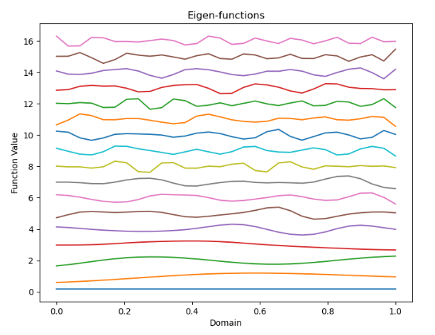

# Neural Basis Function for Time Series Forecasting

After working on a [presentation](https://github.com/gfloto/presentations) on state space models, a pattern in machine learning research was observed. Across a diverse range of tasks, sets of orthonormal basis functions are used. Some examples:

* Memory in RNN's: [Legendre Memory Units](https://papers.nips.cc/paper_files/paper/2019/hash/952285b9b7e7a1be5aa7849f32ffff05-Abstract.html) and [HiPPO](https://arxiv.org/abs/2008.07669), which is used in the recent [Mamba](https://arxiv.org/abs/2312.00752) model uses the Legendre polynomials
* Neural PDE solvers for physics: [Fourier Neural Operator](https://arxiv.org/abs/2010.08895) uses the Fourier basis

Idea: perhaps we could learn a more optimal basis for a given dataset and task...

## Step 1: Choosing An Appropriate Architecture
The [Siren](https://arxiv.org/abs/2006.09661) architecture has been shown to be effective at learning implicit neural representations. In the case of image, if you pass in a point $(x,y,c)$ corresponding to a pixel, the network will output the color of that pixel. Unlike traditional models, we can evaluate the network at any point in the input space, not just the particular resolution of the training data.

Unfortunately, we can only use a Siren model to learn a single basis function. What we really would like it a fast way to train $N$ Siren models at the same time, where each model corresponds to a different basis function. Mr. [lucidrains](https://github.com/lucidrains/siren-pytorch) always has the best code in town, so we will adapt his implimentation. The main change here (see the top of ``models/NeuralBasis.py``) is to use a stack of linear layers and batched matmuls (using the highly under-rated ``torch.einsum`` function). Now, we can quickly train many Siren models in parallel!

## Step 2: Defining the Time Operator
The pipeline for make a time series prediction is a follows:

1. get the inner product of the input series with each of the learned input basis functions  
a. you can use these coefficients and the basis functions to reconstruct (with some loss) the input series  
b. this method is convenient for a few reasons
    * input data can be sampled at arbitrary times
    * interpolation is controlled by the Siren model
    * we perform compression and lifting to a learned function space in simple step

2. map the input coefficients with a **linear** time operator to the output coefficients
3. reconstruct the output series with the learned output basis functions

The full model can be found at the end of ``models/NeuralBasis.py``.  

### Advantages of the Proposed Model 
Considering that the time operator is linear, the predictions it makes are easily interpretable. Furthermore, the trained model is extremely light-weight and fast. As previously mentioned, the advantage of working in function space is that we can sample from the predicted function output at any time, not just at the frequency of the training data.

## Initial Results
On an in-house univariate dataset, the model was able to outperform all benchmarks on short and long-term forecasting. Some of the benchmarks include:

* [Neural Prophet](https://neuralprophet.com/)
* [iTransformer](https://arxiv.org/abs/2310.06625)
* [Lag-Llama](https://arxiv.org/abs/2310.08278)
* [N-BEATS](https://arxiv.org/abs/1905.10437)
* [DeepAR](https://arxiv.org/abs/1704.04110)
* LSTM
* CatBoost (with a number of variants...)

While we can't talk much about the dataset, here is a plot of the 16 functions that make up the learned input basis (sampled at the data frequency):

	

Overall this worked quite well! Especially considering that the time operator we learn is linear. Next, we try the method on a more standard benchmark...

## Further Results
The [thuml](https://github.com/thuml/Time-Series-Library) repo is a great resource for time series forecasting benchmarks. It includes up to date models including methods from ICLR 2024. On the Long-term forecasting look-back-96 look-forward-96 task for the Ettm1 dataset (the first and only one tested so far), our proposed method get 3rd overall place out of more than 2 dozen models.

On this test, we included [reversible instance normalization](https://openreview.net/forum?id=cGDAkQo1C0p) to slightly boost the performance of the model.
